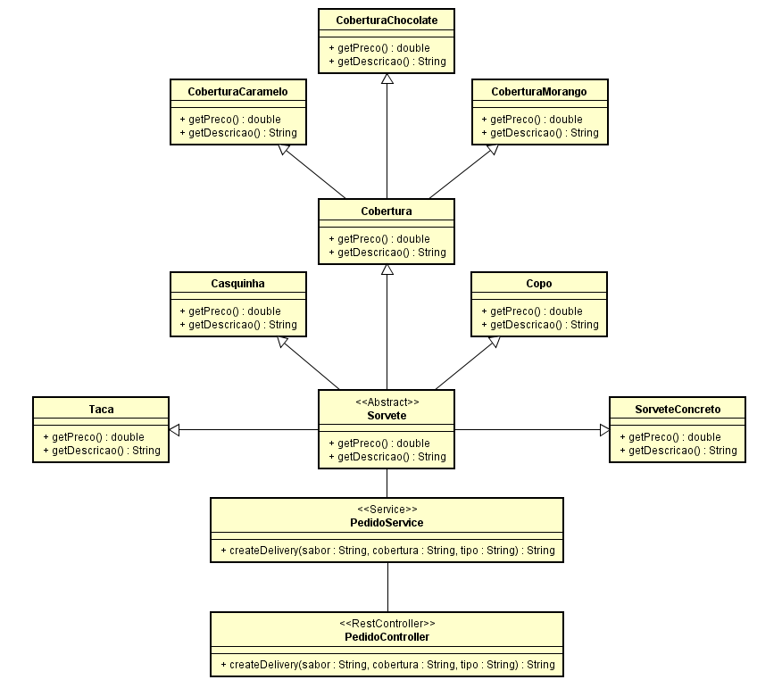

# Exercício 02 - Sorveteria - Sistema de Pedidos Usando o Padrão Decorator

## Aluno: Henrick de Sousa Nogueira

## 📚 Descrição

## Descrição do Problema

Para resolver o problema proposto, criei uma API utilizando Java 17 com uma REST API. O objetivo era implementar um sistema de pedidos para uma sorveteria, onde o cliente pudesse escolher o sabor do sorvete, o tipo de recipiente (copo, taça ou casquinha) e uma cobertura adicional (chocolate, morango ou caramelo). Utilizei o padrão de projeto Decorator para compor os sorvetes de forma dinâmica e flexível, permitindo a adição de diferentes coberturas e recipientes sem a necessidade de criar múltiplas subclasses.

A implementação foi dividida em duas partes principais:

1. Camada de Domínio: Classes do Sorvete
- Sorvete é a classe base abstrata que define os métodos getPreco() e getDescricao().
- SorveteConcreto implementa o sorvete real, recebendo o sabor e o preço base.
- Cobertura é uma classe abstrata que serve como base para as diferentes coberturas, como CoberturaChocolate, CoberturaMorango e CoberturaCaramelo. Cada uma dessas classes decoradoras modifica o preço e a descrição do sorvete.
- Os tipos de recipiente, como Copo, Taça e Casquinha, são implementados diretamente como subclasses de Sorvete, cada uma com seu próprio preço e descrição.
1. Camada de Serviço e Controle
- A classe PedidoService é responsável por processar o pedido. Com base nos parâmetros fornecidos (sabor, tipo de recipiente e cobertura), ela instancia o sorvete adequado e aplica as coberturas desejadas usando o padrão Decorator.

- O método createDelivery lida com a lógica de construção do pedido. Ele primeiro cria o sorvete base com base no sabor escolhido. Em seguida, verifica o tipo de recipiente e a cobertura para compor o pedido final. O preço total é calculado e a descrição é gerada de forma dinâmica, refletindo todas as escolhas feitas pelo cliente.

- PedidoController expõe a API REST, permitindo que os clientes façam pedidos através de uma requisição POST. O cliente envia os parâmetros sabor, cobertura e tipo, e o serviço retorna uma mensagem com a descrição completa do pedido e o preço total.

## Conclusão

Essa solução utiliza o padrão Decorator para garantir flexibilidade e escalabilidade no sistema de pedidos da sorveteria. O uso de uma API REST em Java 17 permite que o sistema seja acessado de forma fácil e eficiente, suportando novas funcionalidades ou tipos de sorvete, coberturas e recipientes no futuro sem grandes modificações no código existente.

## 🛠 Tecnologias

-  [Java](https://www.java.com/pt-BR)
-  [Spring Boot](https://spring.io/projects/spring-boot)